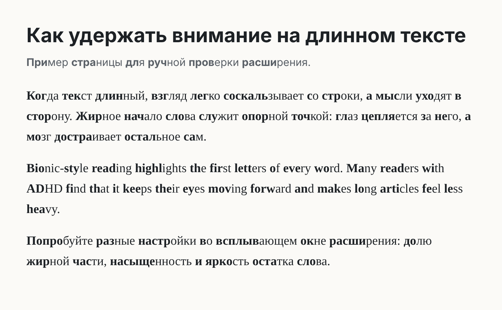
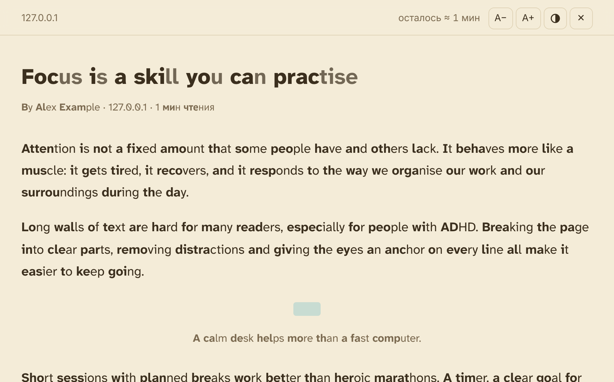
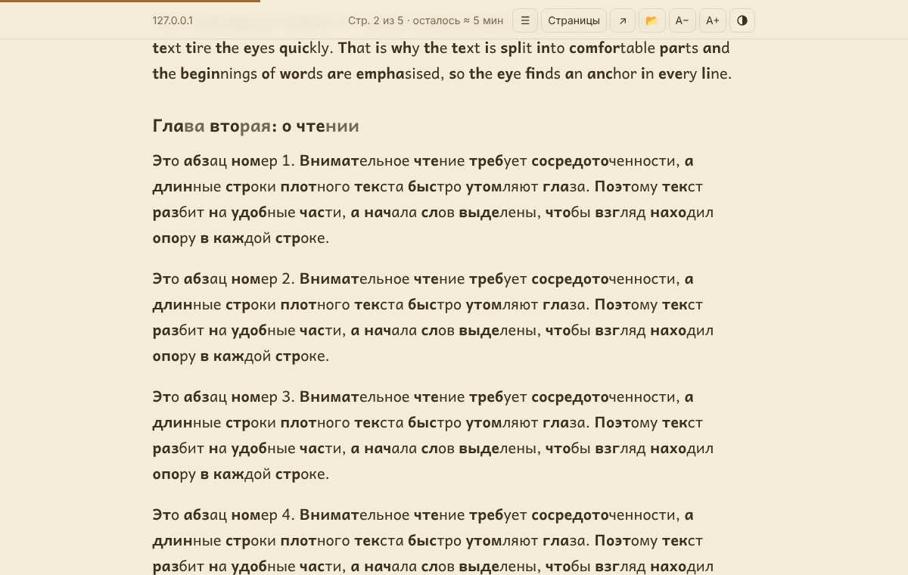
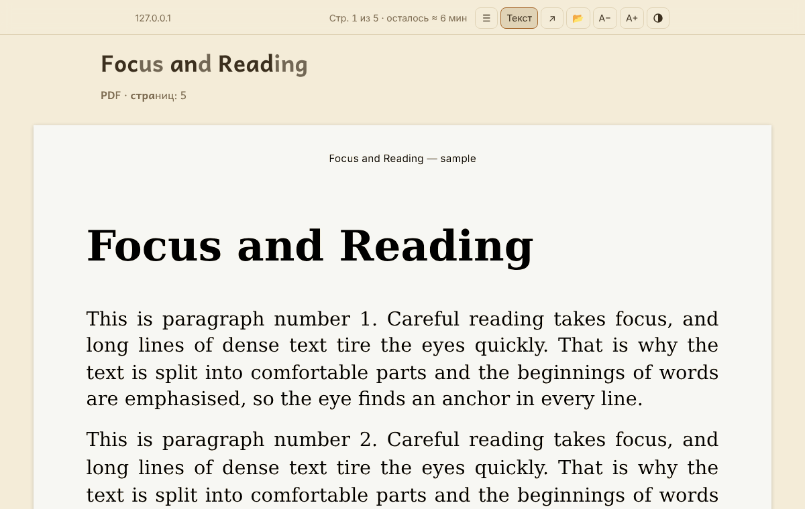
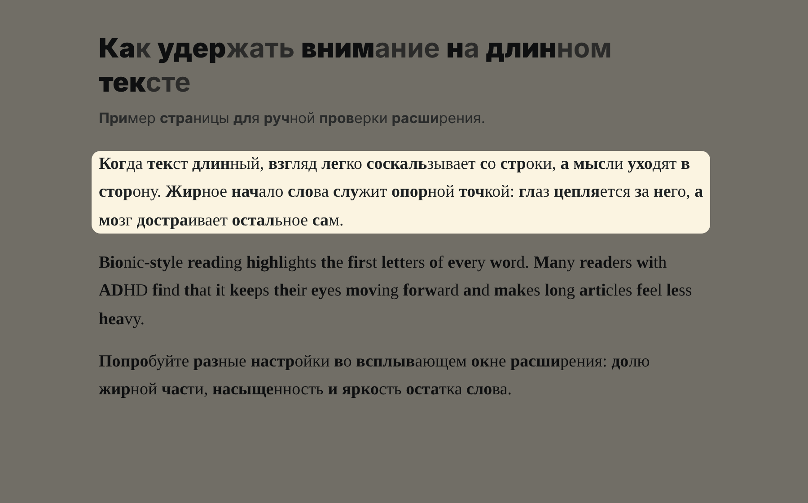

# ADHD Reader

Расширение для Chrome и Firefox, которое помогает читать с экрана людям с СДВГ: выделяет жирным начало каждого слова (по принципу [Bionic Reading](https://bionic-reading.com/)) **на любом сайте и во всём тексте страницы, а также в PDF и электронных книгах**, а ещё убирает отвлекающее, держит фокус на строке или абзаце и делает текст удобнее.



## Что умеет

**Бионическое чтение** — на любом сайте: в динамически подгружаемом контенте, в Shadow DOM (включая закрытый), во фреймах, в SPA на React/Vue и т.п.
- доля жирной части слова, насыщенность, осветление остатка слова;
- «какие слова»: каждое, каждое 2-е, 3-е или 4-е (как saccade в Bionic Reading);
- можно не выделять короткие слова (предлоги, союзы);
- в уже жирном тексте (заголовки, `<strong>`) начало слова становится ещё жирнее, а остаток — светлее, иначе выделения не видно.

**Режим чтения** — показывает только текст статьи, без рекламы, меню, боковых колонок и комментариев (движок Readability из Firefox). Бионика, ваш шрифт, темы (светлая, сепия, тёмная), размер текста и длина строки, полоса прогресса и «осталось ≈ N мин». Работает и на сайтах, где расширение выключено. Esc закрывает.

В **Google Документах и Презентациях** текст нарисован на canvas, и никакое расширение не может его изменить. Режим чтения там берёт тот же документ через экспорт Google (HTML для документов, текст для презентаций) с вашим входом в аккаунт — и показывает его со всеми режимами.



**Просмотрщик документов** — PDF, EPUB, FB2 (в том числе `.fb2.zip` и в кодировке Windows-1251) и TXT открываются в странице расширения, где работает всё: бионика, шрифты, интервалы, темы, тонировка и фокус.
- **PDF** показывается как обычный текст: строки собираются в абзацы и заголовки, колонтитулы и номера страниц убираются, слова, разорванные переносом, склеиваются. Кнопка «Страницы» показывает оригинальные страницы (с выделяемым текстом) — для таблиц, формул и картинок. Сканы без текстового слоя сразу открываются страницами. Закладки PDF становятся оглавлением.
- **Книги** — с оглавлением, картинками и сносками; стили и скрипты книги не используются.
- Просмотрщик **запоминает, где вы остановились**, и показывает недавние документы.
- Как открыть: ссылки на PDF открываются в просмотрщике сами (это можно выключить в настройках; кнопка ↗ покажет оригинал во встроенном просмотрщике браузера); «Открыть файл…» в меню расширения или перетаскивание файла в окно просмотрщика; правый клик по ссылке на PDF/EPUB/FB2 → «Открыть в ADHD Reader».





**Фокус** — затемняет экран, оставляя яркой строку (как линейка для чтения) или абзац под курсором. Сила затемнения настраивается, клики проходят сквозь затемнение.



**Вид страницы**
- шрифты для удобного чтения (встроены в расширение):
  - с кириллицей: **OpenDyslexic** (создан для людей с дислексией; строчная «ж» в нём похожа на заглавную «Ж» — особенность самого шрифта), **Andika** (чёткие, трудно путаемые буквы, создан SIL для начинающих читателей), PT Sans, системный, с засечками;
  - только латиница: Atkinson Hyperlegible и Lexend — русские буквы в них показываются шрифтом PT Sans;
- межстрочный интервал, расстояние между буквами и словами;
- тонировка страницы цветом «бумаги» (кремовый, персиковый, жёлтый, зелёный, голубой, розовый, серый) и общее приглушение яркости.

**Управление**
- иконка на панели — главный переключатель, вкл/выкл на текущем сайте, режим чтения, фокус, «Открыть файл…» и быстрые настройки с предпросмотром;
- контекстное меню (правый клик по странице) — режим чтения, фокус, вкл/выкл на сайте; на ссылке на документ — «Открыть в ADHD Reader»;
- страница «Все настройки» — всё остальное, включая списки сайтов;
- режимы сайтов: «везде, кроме…» или «только на…».

## Горячие клавиши

| Клавиши | Действие |
| --- | --- |
| **Alt+Shift+E** | включить/выключить на текущем сайте |
| **Alt+Shift+R** | открыть/закрыть режим чтения |
| **Alt+Shift+F** | фокус: выкл → строка → абзац |
| — | включить/выключить везде (назначается вручную) |

Изменить сочетания можно в `chrome://extensions/shortcuts` (Chrome) или в «Дополнения и темы» → ⚙ → «Управление горячими клавишами» (Firefox).

> В версии 0.1 для сайта было предложено Alt+Shift+B, но это сочетание занято самим Chrome (переход к панели закладок), и Chrome его молча не назначал. Если после обновления Alt+Shift+E не появилось в `chrome://extensions/shortcuts`, назначьте его там вручную.

## Установка в Chrome (из исходников)

1. Скачайте репозиторий (`git clone` или ZIP). ZIP нужно **распаковать** («Извлечь все…»): Chrome не загружает расширение из архива.
2. Откройте `chrome://extensions` и включите **«Режим разработчика»** (справа вверху).
3. Нажмите **«Загрузить распакованное расширение»** и выберите папку, **внутри которой сразу лежит `manifest.json`** (рядом с папками `src`, `icons`, `_locales`). При распаковке ZIP Windows обычно создаёт вложенную папку с тем же именем: `…\adhd_reader-…\adhd_reader-…\manifest.json` — выбирать нужно внутреннюю.
4. Закрепите иконку расширения на панели (значок пазла → булавка).

Уже открытые вкладки подхватываются сразу, перезагружать их не нужно. Чтобы обновиться до новой версии, замените файлы и нажмите «Обновить» в карточке расширения.

Необязательно:

- для локальных файлов (`file://…`, например `.html` или `.txt` книги) включите в карточке расширения **«Разрешить доступ к URL файлов»**;
- в «Доступ к сайтам» должно стоять **«На всех сайтах»** (это значение по умолчанию).

Должно работать и в других браузерах на Chromium (Edge, Brave, Opera, Яндекс Браузер), но проверялось только в Chrome/Chromium.

## Установка в Firefox

Нужен Firefox 140 или новее. Подходит та же папка, что и для Chrome: `manifest.json` написан сразу для обоих браузеров.

- **На время (до перезапуска Firefox)**: откройте `about:debugging#/runtime/this-firefox` → **«Загрузить временное дополнение…»** → выберите `manifest.json` в распакованной папке расширения.
- **Насовсем**: обычный Firefox устанавливает только дополнения, подписанные Mozilla. Архив расширения можно бесплатно подписать на [addons.mozilla.org](https://addons.mozilla.org/developers/) как «неопубликованное» (unlisted) и установить полученный `.xpi`. Архив для этого делает `npm run build` (нужен [Node.js](https://nodejs.org/)): `dist/adhd-reader-firefox-<версия>.zip`. В Firefox Developer Edition, Nightly и ESR можно вместо подписи выключить её проверку (`xpinstall.signatures.required` = `false` в `about:config`) и установить этот архив через «Установить дополнение из файла…».

Отличия Firefox: локальные PDF (`file://…`) Firefox не даёт дополнениям читать по адресу — откройте файл кнопкой «Выбрать файл» в просмотрщике; горячие клавиши меняются в «Дополнения и темы» → ⚙ → «Управление горячими клавишами».

## Почему оно работает почти везде

Похожие расширения обычно ломаются или отключаются на «сложных» сайтах по нескольким причинам; здесь каждая из них учтена:

| Проблема | Что сделано |
| --- | --- |
| Текст появляется после загрузки (ленты, SPA, подгрузка при прокрутке) | `MutationObserver` следит за всеми изменениями и обрабатывает новый текст порциями во время простоя браузера |
| React/Vue/Svelte держат ссылки на свои текстовые узлы; если узел заменить, приложение падает (`removeChild` на чужом узле) или текст перестаёт обновляться | Исходный текстовый узел **не удаляется**, а очищается, и рядом с ним вставляется наша обёртка. Фреймворк может как угодно менять, двигать или удалять свой узел — обёртка следует за ним |
| Сайт ещё не закончил гидратацию (Next.js, Nuxt и т.п.), и правка DOM вызывает ошибку и полную перерисовку страницы | Обычные страницы обрабатываются сразу после разбора HTML. Страницы, которые фреймворк будет «оживлять», распознаются по разметке: для React и Vue маленький скрипт в контексте страницы (он только читает состояние фреймворка) сообщает, когда гидратация закончилась, а ещё не оживлённые блоки `<Suspense>` доделываются позже; для остальных фреймворков — ожидание их скриптов и паузы в работе страницы |
| Веб-компоненты с Shadow DOM, в том числе закрытым | Открытые корни находятся через `shadowRoot`, закрытые — через `chrome.dom.openOrClosedShadowRoot` (Chrome) и `element.openOrClosedShadowRoot` (Firefox). Шрифты и интервалы попадают внутрь, даже когда бионика выключена |
| Фреймы, включая `about:blank`/`srcdoc` | `all_frames` + `match_origin_as_fallback` |
| Стили сайта ломают вставленные `<b>`/`<span>` (`.x span {…}`, сбросы `b { font: inherit }`) | Свои теги без дефиса (`adhdrw`/`adhdrb`), инлайн-стили с `!important`, обёртка с `all: unset` |
| Строгая Content-Security-Policy запрещает вставлять стили и шрифты | Стили — через конструируемые таблицы стилей (`adoptedStyleSheets`), шрифты — из ресурсов расширения; это проверяется тестом на странице со строгой CSP |
| При копировании в Word/Docs вставляется «полужирная каша» | При копировании наши элементы вырезаются из HTML |
| Сайт постоянно переписывает один и тот же текст или «чинит» наши правки | Такие узлы через несколько попыток оставляются в покое, без бесконечного цикла |

Поля ввода, `contenteditable`, редакторы кода (Monaco, CodeMirror, Ace), терминалы, `<code>`/`<pre>` (по умолчанию), SVG и формулы не трогаются.

## Ограничения

- **Страницы, куда браузер не пускает расширения**: `chrome://…`, Chrome Web Store, страница новой вкладки; в Firefox — `about:…` и addons.mozilla.org.
- **PDF во встроенном просмотрщике браузера** — расширение туда не встраивается, поэтому PDF открываются в собственном просмотрщике. PDF, которые сайт отдаёт через POST-запрос или как скачивание, остаются браузеру — их можно сохранить и открыть через «Открыть файл…». Сложная вёрстка (таблицы, формулы, подписи к рисункам) в текстовом режиме PDF может получиться неаккуратной — для неё есть режим «Страницы».
- **Текст, нарисованный на canvas** (Figma, Miro, часть онлайн-читалок), и текст на картинках. Для Google Документов и Презентаций есть обходной путь через режим чтения.
- **DRM-книги** (Kindle, Литрес в браузере и т.п.) — только в их собственных читалках.
- **Письменности**: бионика работает для латиницы, кириллицы, греческого, армянского, грузинского и иврита. Арабская вязь, индийские письменности, китайский/японский/корейский/тайский пропускаются: разрезание слова ломает их отображение или не имеет смысла.
- **Фокус** работает в основном документе страницы; когда курсор над встроенным фреймом (видео, виджеты), подсветка не двигается.
- **Большие интервалы** (межстрочный, между буквами) могут сдвинуть вёрстку на некоторых сайтах — это осознанный выбор пользователя; по умолчанию они выключены.
- На сайтах, которые «оживляет» фреймворк (React, Vue и т.п.), выделение появляется после гидратации — обычно через доли секунды, на тяжёлых сайтах и медленном интернете — через пару секунд. Раньше трогать такие страницы нельзя: фреймворк перерисует их или удалит вставки. Шрифты и интервалы применяются сразу.
- Вставка элементов в DOM в редких случаях влияет на CSS-селекторы вида `:last-child` или `a + b`. Если сайт выглядит странно — выключите расширение на нём (Alt+Shift+E).

## Разработка

Исходники загружаются в Chrome и Firefox как есть; `npm run build` собирает отдельные пакеты для магазинов в `dist/`.

```
manifest.json
src/
  content/bionic.js        — разбиение на слова и построение «бионического» фрагмента (чистая логика)
  content/engine.js        — движок бионики: обход DOM, MutationObserver, Shadow DOM, копирование
  content/typography.js    — шрифты и интервалы (adoptedStyleSheets)
  content/font-faces.js    — список встроенных шрифтов (генерируется)
  content/overlay.js       — тонировка, приглушение, фокус на строке/абзаце
  content/page-kind.js     — распознавание страниц, которые будет «оживлять» фреймворк
  content/hydration-probe.js — зонд в контексте страницы: закончил ли React/Vue гидратацию
  content/shadow-roots.js  — поиск Shadow DOM для шрифтов, когда бионика выключена
  content/main.js          — точка входа на странице: настройки, связка модулей, момент старта
  content/reader.js        — режим чтения (внедряется по запросу), экспорт Google Docs/Slides
  shared/settings.js       — модель настроек, хранение, правила сайтов
  shared/reading-view.js   — колонка для чтения (режим чтения и просмотрщик): темы, прогресс, бионика
  shared/sanitize.js       — очистка HTML статей и книг
  viewer/viewer.mjs        — просмотрщик документов: открытие, оглавление, место чтения
  viewer/pdf.mjs           — PDF через pdf.js: текстовый режим и страницы
  viewer/reflow.mjs        — сборка текста PDF в абзацы и заголовки (чистая логика)
  viewer/books.mjs         — EPUB, FB2, TXT
  background/service-worker.js — горячие клавиши, меню, значок, режим чтения, открытие PDF
  popup/, options/, ui/    — интерфейс
  vendor/                  — Mozilla Readability (Apache-2.0), pdf.js (Apache-2.0), fflate (MIT)
fonts/                     — встроенные шрифты (SIL OFL, см. fonts/LICENSES.txt)
_locales/{ru,en}/          — переводы интерфейса
tests/unit/                — тесты логики (node:test)
tests/e2e/                 — тесты в настоящем Chromium с загруженным расширением (Playwright)
tests/firefox/             — тесты сборки для Firefox в настоящем Firefox (Selenium + geckodriver)
tests/fixtures/            — тестовые страницы (обычная, React 18 с серверной отрисовкой и без, большая, «новостная», строгая CSP)
scripts/                   — сборка пакетов, генерация иконок, копирование шрифтов и библиотек из npm
```

```bash
npm install
npx playwright install chromium   # один раз, если браузер Playwright ещё не установлен
npm test                          # unit-тесты
npm run test:e2e                  # e2e-тесты расширения в Chromium
npm run build                     # пакеты для Chrome и Firefox в dist/
FIREFOX_BIN=… GECKODRIVER=… npm run test:firefox   # тесты в Firefox (нужны Firefox 140+ и geckodriver)
npm run vendor                    # обновить шрифты, Readability, pdf.js и fflate из node_modules
```

После правок кода нажмите «Обновить» в карточке расширения на `chrome://extensions` — открытые вкладки подхватят новую версию автоматически.

## Перед публикацией в Chrome Web Store и на addons.mozilla.org

- Название **ADHD Reader** уже занято другим расширением в магазине — для публикации понадобится своё.
- **Bionic Reading®** — зарегистрированный товарный знак Bionic Reading AG; его не стоит использовать в названии и описании расширения. В интерфейсе используется общее «бионическое чтение».

Дальнейшие планы — в [docs/ROADMAP.md](docs/ROADMAP.md).
